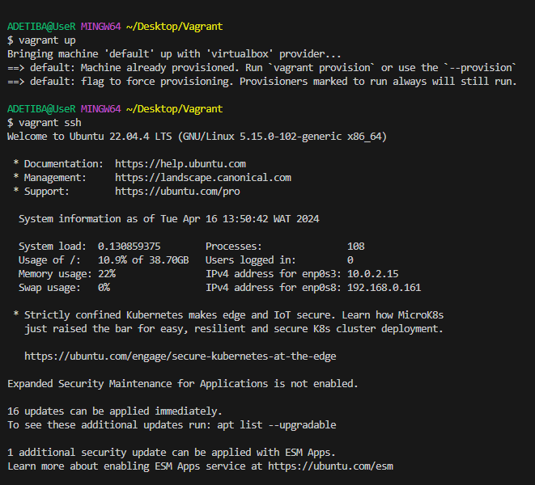
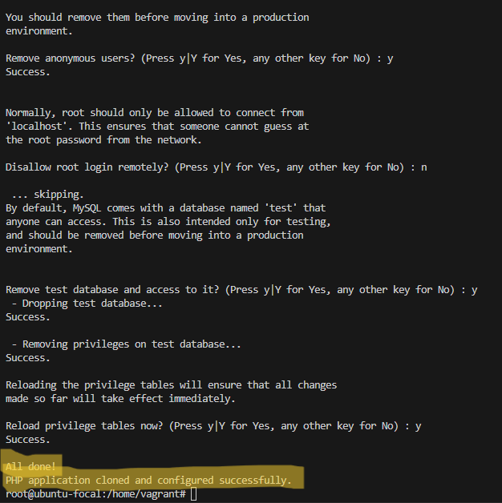
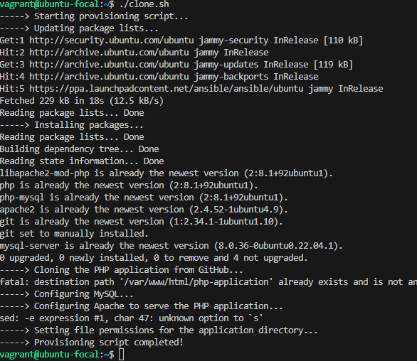

# Automating Ubuntu Servers with Vagrant, LAMP, and Ansible

## Documentation of Steps and Screenshots

## Prerequisites

 1. **Provisioning the Servers with Vagrant**:
 Create two Ubuntu-based servers: one named “Master” and the other “Slave” using Vagrant.
The Vagrantfile will define the configuration for these servers.

 2. **Automating LAMP Stack Deployment on the Master Node:**
On the “Master” node, create a bash script to automate the deployment of a LAMP stack.
This script will:
Clone a PHP application from GitHub.
Install all necessary packages (Linux, Apache, MySQL, PHP).
Configure Apache web server and MySQL ensure the bash script is reusable and readable.

Now Script is Ready to be Automated with Ansible
 3. **Using Ansible to Execute the Bash Script on the Slave Node:**
Using an Ansible playbook to execute the bash script on the “Slave” node.
After execution, verify that the PHP application is accessible through the VM’s IP address.

Verifying The Accessibilty of the PHP application shows in the image below:

 4. Creating a Cron Job for Server Uptime Check:
Finally, set up a cron job to check the server’s uptime every day at 12 am.

Although the cronjob has alredy been added to the playbook.

## Conclusion

Get full review of the playbook, script and vagrant configuration file in my github repository.
<https://github.com/otimstheman>

## References

<https://medium.com/@melihovv/zero-time-deploy-of-laravel-project-with-ansible-3235816676bb>
<https://www.cherryservers.com/blog/how-to-install-and-setup-postgresql-server-on-ubuntu-20-04>
<https://dev.to/sureshramani/how-to-deploy-laravel-project-with-apache-on-ubuntu-36p3>
<https://docs.ansible.com/>

Compiled by *Daniel Adetiba Timilehin*
